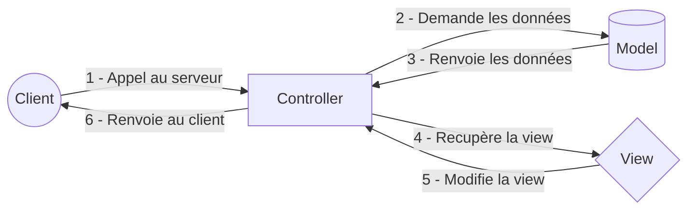

<details>
    <summary>Table des matières</summary>

- [Introduction](README.md)
- [Structure](structure.md)
- [Getting Started](getting-started.md)
- [Console](console.md)
- [Controller](controller.md)
- [Doctrine](doctrine.md)
- [Models](models.md)
- [Migration](migration.md)
- [Repositories](repositories.md)
- [Pratiques](Pratiques.md)

</details>

# Symfony
<center>
   
</center>

## Qu'est-ce que Symfony ?

- 🐘 Framework PHP open source
- 🏢 MVC (Modèle-Vue-Contrôleur)
- 🐓 Francais  
- 🆚 Version actuel 7.1

## Lexique 📖

### Framework
```
Ensemble de composants logiciels réutilisables qui permettent de développer de nouvelles applications plus efficacement
```

Pour faire simple, c'est une structure qui va vous données un cadre pour développer plus facilement et plus efficacement.

### MVC

Le **MVC** est un modèle architectural utilisé dans le développement d'applications, notamment pour les applications web. Il se divise en trois composants principaux : le Modèle, la Vue et le Contrôleur. Cette séparation aide à organiser le code et à faciliter la maintenance.

1. **Modèle (Model)** :
   - Représente les données et la logique métier de l'application.
   - Gère les opérations sur les données, comme la récupération, l'ajout, la mise à jour et la suppression dans la base de données.
   - Il ne s'occupe pas de la manière dont ces données sont affichées.

2. **Vue (View)** :
   - C'est la partie visible de l'application, ce que l'utilisateur voit et avec quoi il interagit.
   - La vue est responsable de la présentation des données, par exemple en affichant des formulaires ou des pages HTML.
   - Elle reçoit les données du modèle et les affiche à l'utilisateur.

3. **Contrôleur (Controller)** :
   - Agit comme un intermédiaire entre le Modèle et la Vue.
   - Il reçoit les entrées de l'utilisateur (comme les clics ou les formulaires), les traite, et appelle le modèle pour obtenir ou modifier des données.
   - Une fois que les données sont mises à jour, le contrôleur choisit la vue à afficher.

